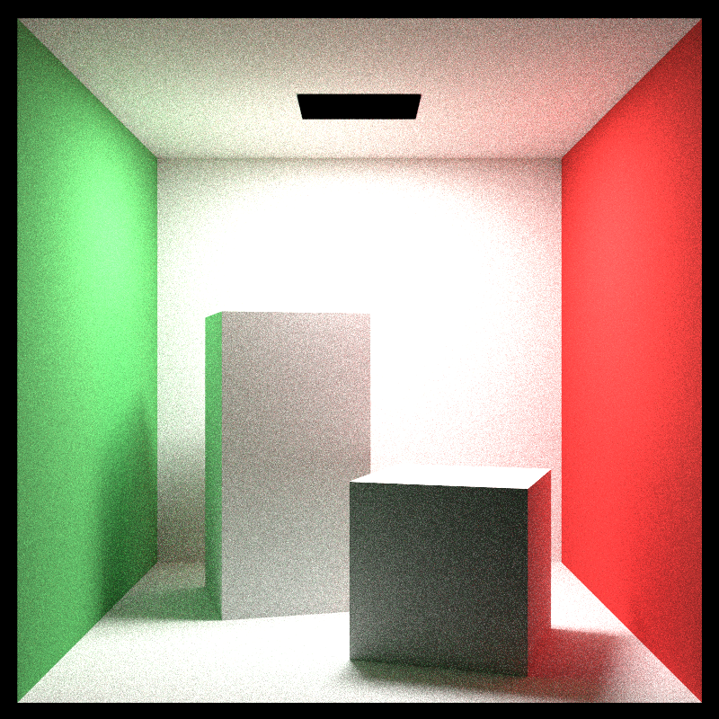
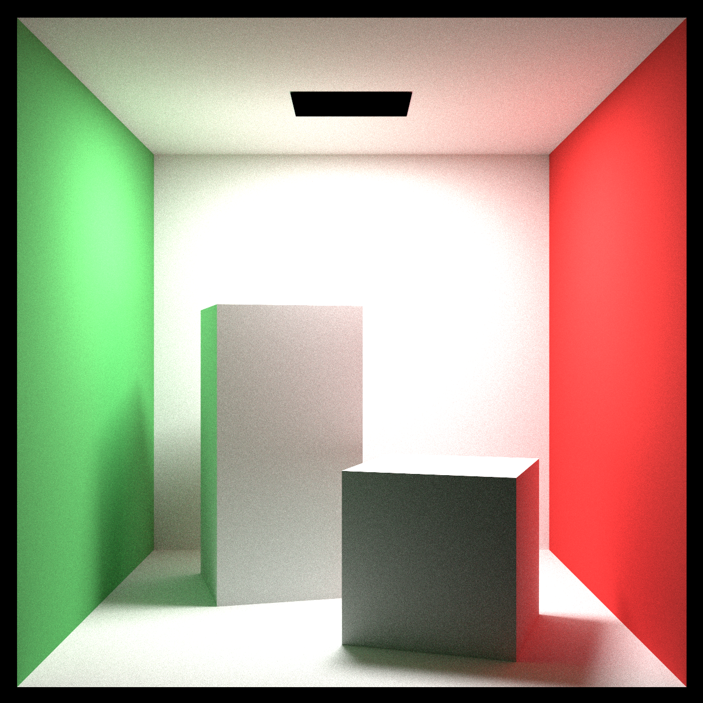

# Ray Tracing Engine

A physically-based CPU/CUDA renderer written in C++, originally following *Ray Tracing: The Next Week* by Peter Shirley and since rebuilt around production techniques: a GGX microfacet BSDF with energy compensation, MIS/NEE, four independent integrators (path tracing, BDPT, progressive photon mapping, ReSTIR DI+GI), HDR environment lighting, glTF meshes, and a CUDA backend that runs the same shading model as the CPU.

Correctness is the point of the project. Every integrator is cross-checked against the others and against both backends by a 295-check test suite.

---

## Renders

| Cornell Box — GPU (1024spp) | High Quality — GPU (4096spp) |
|:---:|:---:|
|  |  |

| Furnace Test — Energy Conservation |
|:---:|
|  |

---

## Platform Support

> **This project runs on Linux only.**
> macOS is not supported — NVIDIA dropped CUDA support on macOS after 2019,
> and the GPU backend is a core part of this project.
> Windows has not been tested.

| Platform | Status |
|:---|:---:|
| Linux (Arch / CachyOS) | ✓ fully supported |
| macOS | ✗ not supported (no CUDA) |
| Windows | untested |

---

## Features

### Integrators
- **Path tracing** — iterative, no recursion; NEE plus BSDF sampling combined with the MIS power heuristic; Russian roulette after depth 3. CPU and GPU.
- **Bidirectional path tracing** — Veach-style, full MIS over all connection strategies including light tracing (`t == 1`) splats. CPU and GPU.
- **Progressive photon mapping** — for specular-to-diffuse transport the other integrators sample poorly. CPU only.
- **ReSTIR DI + GI** — spatiotemporal reservoir resampling from a G-buffer. GPU only, and approximate: its GI is a biased single-bounce estimator, so it is the fast preview mode rather than the reference.

Pick one with `--integrator`; scenes carry a sensible default (`caustics` defaults to BDPT).

### Materials
- **GGX microfacet** metal/dielectric with VNDF sampling, Smith height-correlated masking-shadowing, and Kulla–Conty multiple-scattering energy compensation — Smith GGX drops ~65% of the second-bounce energy at roughness 1, which this adds back
- **Rough dielectric** microfacet transmission (Walter et al. 2007)
- Lambertian diffuse, smooth metal, smooth dielectric with Schlick Fresnel
- Diffuse area lights
- Homogeneous participating media (Henyey–Greenstein phase function), and a subsurface material

### Lighting and Geometry
- HDR environment maps with 2D CDF importance sampling
- glTF and OBJ mesh loading, with a triangle BVH
- Perlin noise, image, and checker textures
- Spheres, boxes, axis-aligned rects, moving spheres, transforms, constant-density media

### Sampling and Precision
- Owen-scrambled (0,2)-sequence low-discrepancy sampler on both backends. The sequence itself is shared integer arithmetic, so the CPU and the GPU path tracer walk the same one; only the state around it differs, since `thread_local` means nothing on the device. GPU ReSTIR still draws from cuRAND — the sampler carries both and falls back when a kernel has not been keyed onto the sequence. Against the white noise it replaced: 19–42% less relMSE on the GPU path tracer for 6–19% more render time, and 30–40% on GPU BDPT for 9%
- Every sampling routine draws a fixed number of dimensions in a fixed order. The rejection loops these replaced drew a variable number, sliding every later dimension along by an amount that changed from path to path, and a low-discrepancy sequence read at shifting dimensions is worth no more than white noise. Measured at 13–19% lower relMSE on `cornell`, `ggx` and `glass` (paired bootstrap over pixels, 95% CI)
- Reproducible renders — the BVH split axis, every camera ray, and every photon are keyed by index rather than by a `random_device` seed and the OpenMP schedule, so the same inputs give the same image on every run, at any thread count and any tile size. BDPT needed work for this: its `t == 1` strategy splats into arbitrary pixels, and summing those under an atomic left the low bits to the thread schedule, since float addition is not associative. Contributions are now bucketed by the pixel that generated the light path and folded in between passes, in pixel order — neither the thread nor the tile can reach the result. It costs about 3.5% on `caustics`
- Single precision throughout by default — FP64 runs at 1/64 rate on consumer NVIDIA parts, and single precision is ~4× faster on the GPU here at no measurable cost in accuracy. Build with `-DRT_DOUBLE=ON` for a double-precision reference.

### Acceleration and Infrastructure
- BVH over both hittables and triangles
- OpenMP across center-priority tiles, for progressive refinement from the middle out
- Intel Open Image Denoise via `--denoise`
- PPM output, or linear HDR OpenEXR — the writer is chosen by the output extension
- Live OpenGL preview that applies the same tonemap as the file writer, so what you see is what gets saved
- ACES filmic tonemap with a firefly clamp at luminance 20

---

## Benchmark

256×256, 64 spp, depth 10, `--no-preview`, each scene's default integrator (path tracing everywhere except `caustics`, which defaults to BDPT). Release build. GPU best of 3, CPU best of 2.

The first three columns are wall clock end to end — process start, scene build, render, image write. The render columns subtract each backend's own `--spp 1` time, isolating the sampling loop from fixed cost. Regenerate the whole table with `python3 tools/benchmark.py`.

| Scene | CPU | GPU | Speedup | CPU render | GPU render | Render speedup |
|:---|---:|---:|---:|---:|---:|---:|
| caustics | 4.04s | 1.54s | 2.6× | 3.95s | 1.34s | 2.9× |
| volume | 1.51s | 0.44s | 3.4× | 1.45s | 0.25s | 5.7× |
| helmet | 1.98s | — | CPU only | 1.58s | — | — |
| bunny | 1.25s | 1.31s | 1.0× | 0.93s | 0.20s | 4.7× |
| cornell | 0.79s | 0.31s | 2.6× | 0.75s | 0.12s | 6.2× |
| sss | 0.75s | 0.30s | 2.5× | 0.71s | 0.12s | 6.0× |
| closed_furnace | 0.47s | — | CPU only | 0.43s | — | — |
| glass | 0.42s | 0.27s | 1.5× | 0.38s | 0.09s | 4.3× |
| hdr | 0.40s | 0.26s | 1.6× | 0.36s | 0.06s | 6.4× |
| ggx | 0.34s | 0.26s | 1.3× | 0.31s | 0.06s | 5.2× |
| furnace | 0.12s | 0.21s | 0.6× | 0.09s | <0.01s | — |

Fixed cost dominates the wall-clock columns at this sample count. On the simple scenes it is ~0.18s for the GPU against ~0.03–0.05s for the CPU — the difference is largely CUDA context creation — so the GPU spends longer starting up than it does rendering. `furnace` is a single sphere and one bounce, so its GPU render falls below what this timing method can resolve.

`bunny` is the extreme case: 0.32s of its CPU time and 1.11s of its GPU time is OBJ parsing and BVH construction, single-threaded work that happens before a ray is cast — which is why it still loses end to end while winning 4.7× on the render itself. That build used to be 1.24s and 2.01s; most of it was `fmin`/`fmax` promoting `real` to double and calling out to libm, once per component per triangle.

The CPU render columns are 1.3–3.6× faster than they were before `hit_record` stopped carrying a `shared_ptr`. Copying one on every intersection cost an atomic increment and decrement, and since a scene has only a handful of materials, sixteen threads were contending for the same few control blocks. `volume` gained most, because a medium interaction writes the record on every scattering event.

The preview window costs ~0.3s of one-time GL context creation. Frame staging is capped at 30 Hz, so its cost tracks wall-clock duration rather than sample count.

**Hardware:**
- CPU: AMD Ryzen 7 5800H (8 cores / 16 threads)
- GPU: NVIDIA RTX 3060 6GB Laptop — CUDA 13.1, sm\_86

Every row above comes from a single pass, best of 2 on the CPU and best of 3 on the GPU. Compare within a pass, not against these absolutes: across three passes taken minutes apart, every row agreed to within 2% except `caustics`, which is both the longest CPU run and the first in the list and so came out 24% faster on the one pass that started from a cold machine. A heat-soaked laptop runs 15–35% slower on both backends, since the GPU figures include CPU-side scene build.

---

## Requirements

### Dependencies
```bash
sudo pacman -S cmake gcc openmp glfw openimagedenoise
```

### CUDA Toolkit (~3GB)
```bash
sudo pacman -S cuda
```

Add to `~/.config/fish/config.fish`:
```fish
set -x PATH /opt/cuda/bin $PATH
set -x LD_LIBRARY_PATH /opt/cuda/lib64 $LD_LIBRARY_PATH
```

Or `~/.bashrc` / `~/.zshrc`:
```bash
export PATH=/opt/cuda/bin:$PATH
export LD_LIBRARY_PATH=/opt/cuda/lib64:$LD_LIBRARY_PATH
```

Verify:
```bash
nvcc --version
nvidia-smi
```

> This project targets **sm_86** (RTX 30xx). Change `CMAKE_CUDA_ARCHITECTURES`
> in `CMakeLists.txt` to match your GPU.
> Find your compute capability at: https://developer.nvidia.com/cuda-gpus

---

## Build

```bash
git clone https://github.com/Vishrut2403/Ray-Tracing-Engine
cd Ray-Tracing-Engine
cmake -S . -B build
cmake --build build
```

This defaults to a Release build. The optimisation level matters more than it usually does here — an unoptimised CPU backend runs 2.4–5.2× slower — so pass `-DCMAKE_BUILD_TYPE=Debug` explicitly if that is what you want, and expect the benchmark figures above not to hold.

Double-precision reference build:

```bash
cmake -S . -B build-double -DRT_DOUBLE=ON
cmake --build build-double
```

---

## Usage

Arguments are positional: `render <output> [scene] [flags]`. The output extension picks the writer — `.exr` gives linear HDR, anything else is tonemapped PPM.

```bash
# CPU render with live preview
./build/render output.ppm cornell --spp 400 --width 800 --height 800

# GPU render with live preview
./build/render output.ppm cornell --spp 400 --width 800 --height 800 --device gpu

# Headless GPU render (fastest)
./build/render output.ppm cornell --spp 1024 --width 1200 --height 1200 --device gpu --no-preview

# Caustics through bidirectional path tracing
./build/render caustics.ppm caustics --integrator bdpt --no-preview

# Photon mapping, with denoising
./build/render ppm.ppm ppm --integrator ppm --denoise --no-preview

# Linear HDR output, for grading elsewhere
./build/render output.exr cornell --spp 512 --device gpu --no-preview

# Energy conservation validation
./build/render furnace.ppm furnace --no-preview

# Look at the scene's geometry instead of rendering it
./build/render out.ppm bunny --viewport --width 1280 --height 720
```

**Flags:**

| Flag | Short | Default | Description |
|:---|:---:|:---:|:---|
| `--width N` | `-w` | 400 | Image width in pixels |
| `--height N` | `-h` | 400 | Image height in pixels |
| `--spp N` | `-s` | 64 | Samples per pixel |
| `--depth N` | `-d` | 10 | Maximum ray bounce depth |
| `--tile N` | `-t` | 32 | Tile size (CPU only) |
| `--device cpu\|gpu` | | cpu | Render backend |
| `--integrator pt\|bdpt\|ppm\|restir` | | per scene | Override the scene's integrator |
| `--denoise` | | off | Run Open Image Denoise on the result |
| `--no-preview` | | off | Headless; no OpenGL window |
| `--viewport` | | off | Open the scene in the viewport instead of rendering it |
| `--rendered` | | off | Open the viewport straight into rendered mode |

**Viewport navigation** (Blender's bindings, on a y-up world):

| Input | Action |
|:---|:---|
| MMB drag / `Alt` + LMB drag | Orbit |
| `Shift` + MMB drag | Pan |
| `Ctrl` + MMB drag, scroll wheel, numpad `+`/`-` | Zoom |
| Numpad `1` / `3` / `7` | Front / right / top, orthographic (`Ctrl` for the opposite side) |
| Numpad `9` | Swing round to the other side |
| Numpad `5` | Toggle orthographic |
| Numpad `2` `4` `6` `8` | Orbit in 15 degree steps |
| `R` | Toggle rendered mode: path-trace the framed view |
| `M` | Toggle material colours against Blender's flat grey |
| `Home` | Frame the whole scene |
| `Esc` | Close |

The view opens where the scene's render camera stands, so what you see is what
would be rendered. Dragging moves the scene rather than the camera: drag right
and the scene follows right.

Rendered mode traces exactly what the view frames, refining pass by pass, and
restarts from scratch a frame after the view settles. It uses `--spp`, `--depth`
and `--device` like an offline render, and drops back to perspective on the way
in since the tracer has no orthographic camera.

Solid shading lights the scene with three fixed studio lights in view space, so
they follow the camera and every surface stays readable however the view is
turned. Surfaces take their colour from the material — glass gets a pale cast
since it has no albedo to show, and emitters draw flat at their own hue. None
of it is a physical quantity: it is there to show shape, not to be correct.

**Scenes:** `cornell`, `furnace`, `closed_furnace`, `ggx`, `hdr`, `bunny`, `glass`, `caustics`, `helmet`, `ppm`, `sss`, `volume`.

`furnace` starts from its own defaults — 200×200 at 256 spp, against the white environment the test needs — and any flag you pass overrides them.

The GPU implements `cornell`, `furnace`, `ggx`, `hdr`, `bunny`, `glass`, `caustics`, `volume`, and `sss`; anything else falls back to the CPU with a note. Progressive photon mapping is CPU-only.

---

## Validation

```bash
./build/tests
```

707 checks covering:

- **Sampling routines** — each draws a fixed, order-stable number of dimensions, and the distributions are checked by equal-measure binning: equal-area rings and sectors on the disk, equal-solid-angle bands on the sphere, equal-volume shells in the ball
- **Analytic BSDF identities** — white furnace (`E[f·cos/pdf]` matches the known albedo and never exceeds 1), Helmholtz reciprocity, PDF normalization, and the `f·cos/pdf = G2/G1` cancellation for VNDF sampling
- **Energy conservation** — the closed furnace, where `L = Le/(1-rho)` must converge to exactly 1 across the whole image, catches throughput and PDF bugs that the open furnace misses
- **Cross-backend agreement** — CPU and GPU means must agree on `cornell`, `glass`, and `ggx`
- **Cross-integrator agreement** — PT against BDPT, and PPM against BDPT; three independent estimators of the same integral disagreeing means at least one is wrong
- **Determinism** — BDPT rendered twice gives the same image bit for bit, and the same at tile sizes 16, 32 and 64; the splat accumulation order is the one place a thread schedule could reach the pixels
- **Photon mapping invariants** — the result must not depend on the iteration count
- **Denoiser** — output finite, non-negative, and energy-preserving

Sampling changes are judged separately, since they move variance rather than
correctness and the suite cannot see them. `tools/relmse.py` measures relMSE
against a converged reference, and `--compare` puts a paired bootstrap
confidence interval on the ratio between two renders — a single relMSE number
is one draw of a random quantity, so two of them cannot be compared by eye.

```bash
./build/render ref.exr cornell --spp 4096 --no-preview
./build/render after.exr cornell --spp 32 --no-preview
python3 tools/relmse.py --compare ref.exr before.exr after.exr
```

Bounds are self-calibrating: Monte Carlo checks derive their tolerance from the estimator's own standard error rather than a fixed margin, so they neither pass trivially nor fail at random. Numeric tolerances scale off `std::numeric_limits<real>::epsilon()`, so the suite is meaningful in both the float and double builds.

---

## Origin and Extensions

This project started as an implementation of *Ray Tracing: The Next Week* (Peter Shirley), covering BVH acceleration, procedural textures, motion blur, constant-density volumes, and the Cornell box scene.

Extended beyond the book:

| What changed | Why |
|:---|:---|
| Recursive scatter → iterative `Li()` | No stack overflow, GPU-portable |
| Scatter/attenuation → `f / sample / pdf / emitted` BSDF interface | Correct MIS requires separate eval and sample |
| Single-bounce direct → NEE + MIS power heuristic | Lower variance, correct weighting |
| Schlick-only dielectrics → GGX microfacet with Kulla–Conty compensation | The book's materials lose energy and cannot represent rough metal |
| `shared_ptr` scene → flat tagged-union arrays | Required for CUDA device code |
| CPU-only → dual CPU/CUDA backend | Up to 6× on the render itself, with identical shading on both |
| One integrator → PT, BDPT, PPM, ReSTIR | Caustics and SDS paths need estimators the book's approach cannot reach |
| Double → single precision, with a double build kept as reference | 4× on the GPU; the double build is how the float build is checked |
| White noise → Owen-scrambled (0,2)-sequence | Stratification the RNG cannot give |
| Rejection sampling → analytic inversion | A varying dimension count is what costs that sequence its stratification |
| cuRAND on the GPU → the same sequence as the CPU | 19–42% less relMSE on the path tracer, 30–40% on BDPT, for 6–19% more time |
| Ad-hoc eyeballing → 707-check suite | Catches PDF and throughput bugs before they show visually |

---

## Roadmap

- [x] GGX microfacet BRDF with Smith masking-shadowing
- [x] HDR environment map with 2D CDF importance sampling
- [x] Rough dielectric (microfacet transmission)
- [x] OBJ / glTF scene loading
- [x] Bidirectional path tracing (BDPT)
- [x] Progressive photon mapping
- [x] ReSTIR direct and indirect lighting
- [x] EXR output via tinyexr
- [x] Port the low-discrepancy sampler to the GPU path tracer and BDPT
- [x] Hoist the GPU scene upload out of `cuda_render` so a viewport render can restart without paying for it
- [ ] Decide whether GPU ReSTIR should be keyed onto the sequence — its resampling reads neighbouring reservoirs, so it is not a given that a per-pixel sequence helps there
- [x] Cut the mesh scene build — 3.6× on the CPU, 1.8× on the GPU
- [x] Make BDPT reproducible — the splat sum no longer depends on the thread schedule or the tiling
- [x] Take the `shared_ptr` off the intersection hot path — 1.3–3.6× on the CPU render
- [ ] OptiX backend (hardware RT cores)
- [ ] Light trees for many-light scenes
- [ ] Spectral rendering (hero wavelength)
